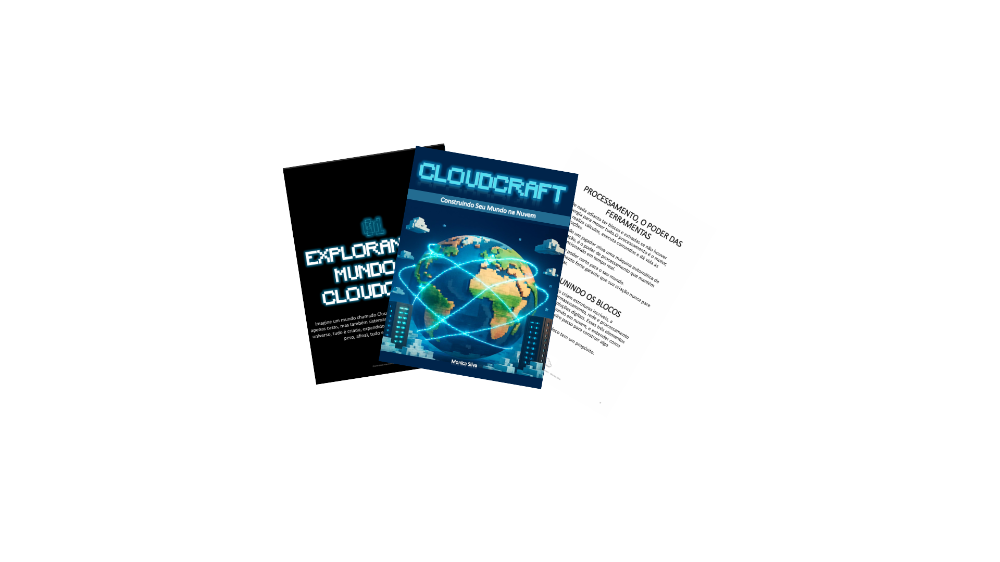

  

# Projeto EBOOK Gerado por I.A.s

 > ℹ️ **NOTE:** Este repositório foi desenvolvido durante o curso de Fundamentos de IA Generativa.

Projeto com o objetivo de gerar um ebook digital com as facilidades das ferramentas de IA.

<a 
  href="output/ebook_CloudCraft_Construindo seu mundo na nuvem.pdf" 
  type="application/pdf" 
  target="_blank" 
  title="View PDF now">
  📕 Clique aqui para ler
</a>

## 💻 Tecnologias utilizadas no projeto

- [ChatGPT](https://chat.openai.com/) 
- [Copilot](https://copilot.microsoft.com/)
- [PowerPoint](https://www.microsoft.com/en/microsoft-365/powerpoint)

## 🧠 Prompts

ChatGPT：

|   Ação   | prompt                                                                                                                                                                                                                                                                         |
| :------: | ------------------------------------------------------------------------------------------------------------------------------------------------------------------------------------------------------------------------------------------------------------------------------ |
|  título  | Crie um título de um eBook sobre o tema de computação em nuvem, o eBook é nicho cloud e o subnicho é compreendendo os conceitos de cloud, o título deve ser curto e que tenha uma dinâmica do jogo Minecraft. Me liste 5 variações de títulos.                                                      |
| conteúdo |Faça um texto para e-book, o foco é para computação em nuvem, trazendo a introdução da computação em nuvem, com exemplos baseados em um mundo como Minecraft{Regras} Explique sempre de maneira simples. Deixe o texto enxuto no livro, não coloque o nome Minecraft, para fazer a alusão, o nome do mundo é CLOUDCRAF. Sempre traga exemplos em contexto do mundo Claudcraft, sempre deixe um texto sugestivo por tópico.|

Copilot： 

|  Ação  | prompt                                                                                 |
| :----: | -------------------------------------------------------------------------------------- |
| Capa | Global cloud computing infrastructure, showing scalable worldwide connectivity, glowing data lines connecting continents on Earth, modern data centers, realistic clouds merging with digital networks, soft cinematic lighting, professional corporate style, 8K Minecraft-style photo |

